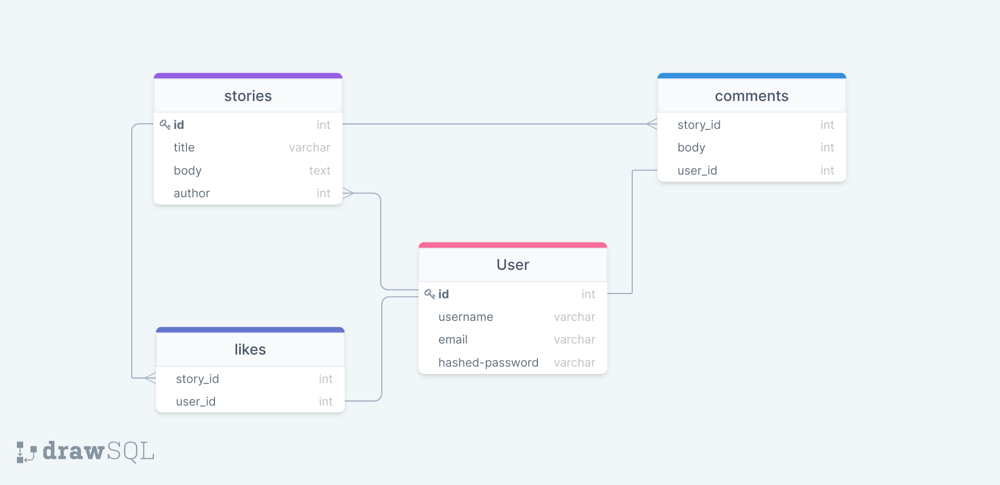

<h1 align="center">
  
  <br>
  Documentation
</h1>
<h1 align="center">
  
  
  
  
</h1>

<h1 align="center">
  Overview
</h1>
<h4>
first_draft is a web app that allows user to create an account to create stories and share their thoughts.
</h4>

---

<h1 align="center" >
 
</h1>

<h4 align="center">'first_draft' is a web app inspired by 'Medium' that allows users to share thoughts, stories, and experience. A logged in users have the ability to create stories, giving comments, likes, & follows.
<pFirst_draft is built with React, Flask, Python and PostgreSQL, SQLAlchemy</h4>

---

<h1>Database Schema</h1>

 

---

<h1>Features</h1>
<h3>Login</h3>

<h4 align='left'; font-size:2em;>

```js
@auth_routes.route('/login', methods=['POST'])
def login():
    """
    Logs a user in
    """
    form = LoginForm()
    print(request.get_json())
    # Get the csrf_token from the request cookie and put it into the
    # form manually to validate_on_submit can be used
    form['csrf_token'].data = request.cookies['csrf_token']
    if form.validate_on_submit():
        # Add the user to the session, we are logged in!
        user = User.query.filter(User.email == form.data['email']).first()
        login_user(user)
        return user.to_dict()
    return {'errors': validation_errors_to_error_messages(form.errors)}, 401

```
